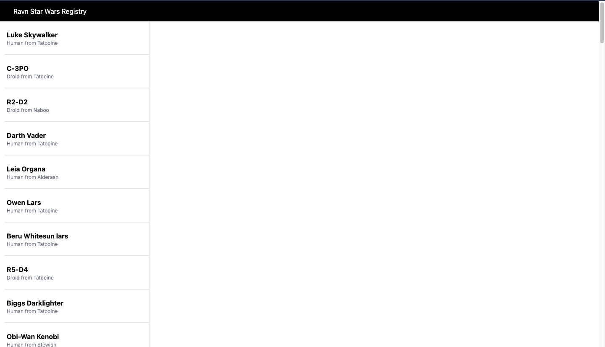
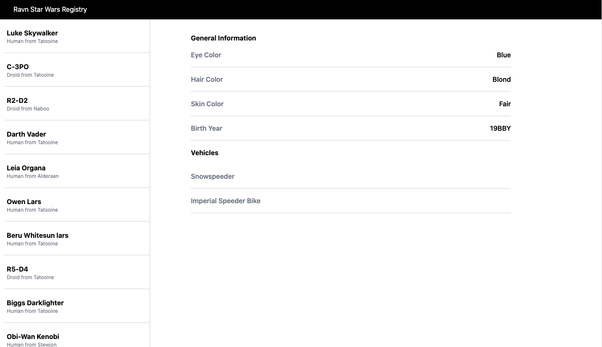

# Ravn Star Wars Registry

It is an application developed with ReactJs that consumes an Api and displays data dynamically. It loads 5 by 5 characters, and displays the information of each one.
## Requirements

- [ ] Use Apollo GraphQL client
- [ ] Show loading indicator when necessary.
- [ ] Indicate when a query has failed.
- [ ] Uses the allPeople field to load all people from the API. Should load 5 people at a time until all people are available on the client application.
- [ ] Shows details of a person.

## How it works

After downloading the application, prepare the software with:

```
yarn install
```

next, execute:
```
yarn start
```
then open your web browser with the following address:
```
http://localhost:3000/
```

## Views

### Desktop

Main screen



Information screen



Loading screen


Error screen


Gif of how it works


### Development Requirements
- React
- Apollo Client
- GraphQL
- NodeJS v14.17.2